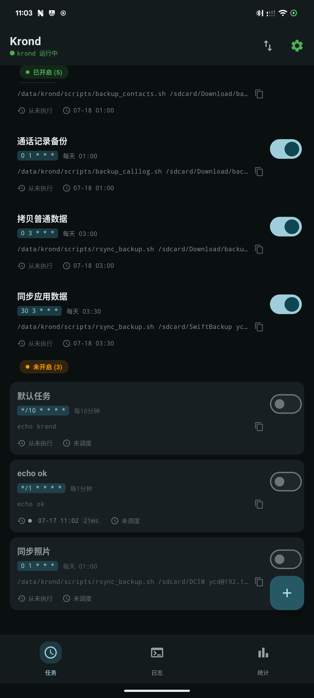
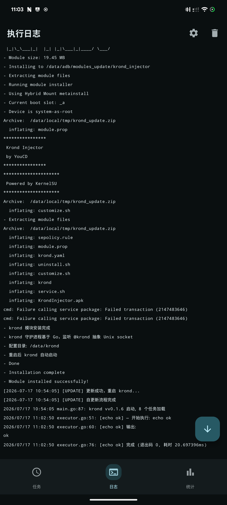
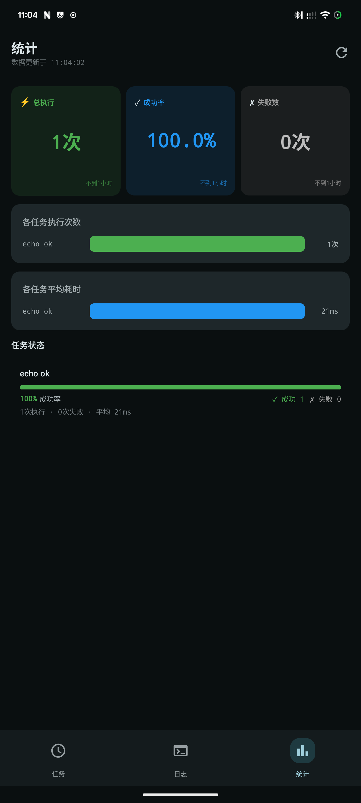

# Krond Injector — Magisk/KernelSU 模块

<p align="center">
  
</p>

基于 Go 自研守护进程 **`krond`** 的 Android 定时任务后端。App 通过 **抽象 Unix socket (`@krond`)** 与 krond 通信（junixsocket + OkHttp），无需 root 即可管理任务。

---

## 目录

- [架构](#架构)
- [界面预览](#界面预览)
- [模块结构](#模块结构)
- [编译指南](#编译指南)
- [脚本管理](#脚本管理)
- [自更新](#自更新)
- [日志管理](#日志管理)
- [常见问题](#常见问题)

---

## 架构

```
┌─────────────────────────┐         @krond (AF_UNIX 抽象命名空间)
│  App (online.youcd.krond)│  HTTP    ┌──────────────────────────┐
│  OkHttp + junixsocket   │ ───────► │  krond daemon (root)     │
│  - 任务增删改查          │ ◄─────── │  - HTTP server @krond     │
│  - 启停(经 su 调子命令)  │  socket  │  - robfig/cron 调度       │
│  - 日志/配置查看设置     │          │  - 执行命令(root)         │
└─────────────────────────┘          └───────────┬──────────────┘
                                                 │ exec /system/bin/sh -c
                                                 ▼
                                        任意 shell 命令 / 脚本
                                        krond 日志 → krond.log + logcat
```

**关键设计决策**：

| 项 | 方案 |
|----|------|
| 后端 | Go 守护进程 krond，调度库 `robfig/cron/v3` |
| 通信 | 抽象命名空间 Unix socket `@krond` |
| App 端 | junixsocket (`AFUNIXSocketAddress.inAbstractNamespace` + `AFSocketFactory.fixedAddressSocketFactory` 注入 OkHttp) |
| 鉴权 | SELinux 隔离（`sepolicy.rule` 限制 App 域 `connectto`） |
| 启停 | App 经 `su -c krond start\|stop\|restart`；任务读写/状态/日志走 socket |
| 配置 | YAML（`/data/krond/krond.yaml`，含 `jobs` 数组，变更即落盘） |
| 日志 | 支持运行时切换：仅文件 / 仅 logcat / 双写 |
| 自更新 | App 触发 → krond 调用 GitHub Releases API 检查/下载/安装；Token 由 CI secret 注入 |

---

## 界面预览

<p align="center">
  
  
  
</p>

App 功能说明：
- **主页**：任务列表，Switch 启停，长按卡片编辑/删除
- **新增任务**：表单输入 cron 表达式 + shell 命令
- **导入/导出**：tar 文件（任务 JSON + 脚本文件）
- **日志页**：齿轮菜单切换日志模式（文件/logcat/双写）

---

## 模块结构

```
krond_injector/
├── krond                          # Go 编译产物（arm64, NDK 动态链接）
├── krond.yaml                     # 默认配置（首启复制到 /data/krond）
├── KrondInjector.apk              # 管理 App（由 service.sh 开机后 pm install）
├── module.prop                    # 模块元信息
├── customize.sh                   # 安装时：设权限、建目录、复制默认配置
├── service.sh                     # 启动时：等待 boot → pm install → logwrapper krond run
├── uninstall.sh                   # 卸载时：停止 krond、清理 /data/krond、延迟卸载 App
├── sepolicy.rule                  # SELinux 规则（允许 App 连接 @krond）
├── update                         # 空标记文件，表示已从旧版更新过
└── META-INF/com/google/android/
    └── updater-script
```

### 关键文件说明

#### `krond` — Go 守护进程

子命令：

| 命令 | 说明 |
|------|------|
| `krond run` | 前台运行（供 service.sh 使用） |
| `krond start` | 后台启动（Setsid 脱离终端 + 写 pidfile） |
| `krond stop` | 停止（SIGTERM → 3s 超时 SIGKILL） |
| `krond restart` | restart |
| `krond version` | 版本号 |

#### `krond.yaml` — 默认配置

```yaml
socket: "@krond"
log_file: "/data/krond/logs/krond.log"  # 日志文件（logs/ 子目录自动创建）
pid_file: "/data/krond/krond.pid"
log_target: "both"      # file | logcat | both
jobs: []                # 通过 App 管理
```

通过 App 日志页的设置下拉可运行时切换 `log_target`，无需重启 krond。

#### `service.sh` — 开机自启

等待 `sys.boot_completed=1` → 复制默认配置 → `pm install` App → `logwrapper krond run`（无 logwrapper 则降级 nohup）。

#### `sepolicy.rule` — SELinux 规则

允许 App 连接 `@krond` socket。若连接失败，用 `ps -Z | grep krond` 确认 krond domain 替换规则中的 `su`。

---

## 编译指南

### 前置条件

- Go 1.26+（交叉编译 krond）
- Android SDK + JDK 21（编译 App）
- Android NDK（推荐 krond 编译用，Bionic libc 原生处理 DNS/TLS）
- GitHub Token（可选，避免 API 限流；设环境变量 `GH_RELEASE`）

### 一键编译（模块 zip）

```bash
# 自动从 git tag 取版本
bash build-module.sh

# 手动指定版本
bash build-module.sh v0.1.7

# 注入 GitHub Token（避免 API rate limit）
GH_RELEASE=ghp_xxx bash build-module.sh v0.1.7
```

生成 `krond_injector.zip`，包含 krond 二进制 + 默认配置 + App APK + 模块脚本。

### 分步编译

#### 编译 krond（推荐 NDK + CGO）

```bash
NDK_HOME=$ANDROID_HOME/ndk/27.0.12077973
CC="$NDK_HOME/toolchains/llvm/prebuilt/linux-x86_64/bin/aarch64-linux-android21-clang"
cd krond
CGO_ENABLED=1 GOOS=android GOARCH=arm64 CC="$CC" \
  go build -ldflags "-X main.Version=v0.1.7 $(if [ -n \"$GH_RELEASE\" ]; then echo -X main.GithubToken=$GH_RELEASE; fi)" \
  -o ../krond_injector/krond .
```

> 若不配置 NDK，`build-module.sh` 会自动查找 `$ANDROID_HOME/ndk/*` 或 `$HOME/Android/Sdk/ndk/*`，均失败时回退纯静态编译（纯 Go HTTP 在 Android 上可能 DNS/TLS 异常）。

#### 编译 App

```bash
cd krond_app
./gradlew assembleRelease
cp app/build/outputs/apk/release/app-release.apk ../krond_injector/KrondInjector.apk
```

#### 刷入模块

```bash
adb push krond_injector.zip /sdcard/
# 在 KernelSU Manager 中刷入
```

刷入后 krond 在开机时自动启动，管理 App 由 `service.sh` 在开机完成后自动 `pm install`（首次需在 KernelSU Manager 中授予 App root 权限）。

---

## 脚本管理

所有用户脚本存放在 `/data/krond/scripts/` 目录下，cron job 通过 `command` 字段调用。此目录结构会随导出 tar 一并备份。

### 目录结构

```
/data/krond/scripts/
├── logs/                          # 脚本自身输出的执行日志（非 krond 日志）
└── ssh_key/                       # SSH 密钥（敏感数据，注意备份安全）
    ├── id_ed25519
    ├── id_ed25519.pub
    └── known_hosts
```

### 脚本基本规范

每个脚本应遵循以下约定：

```bash
#!/system/bin/sh

LOG="/data/krond/scripts/logs/my_task_$(date +%Y%m%d).log"
exec >> "$LOG" 2>&1

set -e

echo "[$(date '+%Y-%m-%d %H:%M:%S')] 开始执行 $0"
# 你的业务逻辑
echo "doing work..."
exit 0
```

**要点**：
- **Shebang** 统一用 `#!/system/bin/sh`（Android shell 路径）
- **失败处理**：用 `set -e` 让脚本在出错时立即退出，避免静默失败
- **日志持久化**：脚本的 stdout/stderr **不会**自动写入 krond 日志。需在脚本开头用 `exec >> logfile 2>&1` 自行重定向
- **退出码**：krond 记录 `lastExitCode`，App 任务列表可查看。`0` 成功，非 `0` 失败

### 测试脚本

脚本写好后先手动验证再挂 job：

```bash
adb shell sh /data/krond/scripts/my_script.sh
echo $?   # 看退出码
```

确认日志文件正确输出后，再到 App 中绑定 cron job。

### Android 环境说明

- **Shell**：`#!/system/bin/sh` 实际是 **mksh**（MirBSD Korn Shell），不是 bash。数组、`$RANDOM`、`{1..10}` 等 bash 特性不可用
- **工具箱**：Android 内置 **toybox**（旧版 toolbox），非 GNU。常见差异：
  - `grep -P`（Perl 正则）不工作，用 `grep -E`（ERE 正则）代替
  - `sed -i` 不支持无备份扩展名，需写为 `sed -i.bak` 带后缀或用临时文件
  - `awk`、`find` 默认可用但功能裁剪
- **CWD**：cron job 执行时工作目录为 **`/`**，脚本中路径请始终使用**绝对路径**

### 定时执行行为

krond 使用了 `cron.New()` 默认调度器：

1. **`cmd.Run()` 阻塞等待**：`executeJob` 会等待脚本进程退出才记录结果。脚本内用 `&` 扔后台的任务会随脚本退出而被 init 收养，不影响定时器
2. **无防并发保护**：默认**不启用** `SkipIfStillRunning`。若脚本是长任务（如 `rsync` 大文件），下一个 tick 到来时**会再启动一个新的副本**，新旧可能并行执行
3. **定时器本身精准**：不管脚本跑多久，cron 的 `Next` 计算始终按原始 schedule 触发，不受脚本执行时长偏移

> 对于 `am start` 跳转 Activity 的脚本，脚本瞬间退出，不会有并发问题。对于 rsync、tar 等耗时任务，如需要防重入，可在脚本内用 `flock` 加互斥锁。

### 异步脚本耗时统计

`am start` 跳转 Activity 是 fire-and-forget 模式，脚本发起后立即退出。此时 krond 记录的 `lastDuration` 只有几毫秒、不代表实际备份时长。

解决方案：**脚本阻塞等待 Activity 产出结果**。

```bash
#!/system/bin/sh
OUTPUT_DIR=/sdcard/backup

# 1. 发起备份
am start -n com.example/.BackupActivity -e output_path "$OUTPUT_DIR"

# 2. 轮询等待结果文件出现（最长 20 秒）
BACKUP_FILE=
for i in 1 2 3 4 5 6 7 8 9 10; do
    sleep 2
    for f in "$OUTPUT_DIR"/*.vcf; do
        [ -f "$f" ] && BACKUP_FILE=$f && break
    done
    [ -n "$BACKUP_FILE" ] && break
done

# 3. 输出结果
if [ -n "$BACKUP_FILE" ]; then
    echo "完成: $BACKUP_FILE ($(stat -c%s "$BACKUP_FILE") 字节)"
else
    echo "超时，未检测到备份文件" >&2
    exit 1
fi
```

这样脚本会**阻塞到 Activity 产出文件才退出**，krond 记录的 `lastDuration` 等于实际耗时，`lastExitCode` 也能反映真实结果（文件出现 = 0，超时 = 1）。

> 轮询路径和条件需要了解目标 App 会在哪里写什么文件。示例中的 `.vcf` 是通讯录 App 的输出模式。

### 参考示例

仓库 `script_example/` 目录提供了可直接使用的示例脚本（手机上位于 `/data/krond/scripts/`）：

| 脚本 | 功能 | 亮点 |
|---|---|---|
| `backup_contacts.sh` | 通过 Fossify Contacts 无头 Activity 备份通讯录 | 参数传输出目录、重试 3 次、等待检测 .vcf 文件、tee 双写日志 |
| `backup_calllog.sh` | 通过 Fossify Phone 备份通话记录 | 同上模式，检测 .vcf/.xml |
| `rsync_backup.sh` | rsync + SSH 密钥远程同步 | 3 参数（源/主机/目标）、`rsync -avz`、日志记录同步结果 |
| `databackup_cron.sh` | 触发 Swift Backup 备份计划（旧版参考） | am start 封装，支持传 schedule_id |
| `hello.sh` | `echo hello` | 最简验证脚本 |

### 如何创建新脚本

1. **上传脚本文件**：App → 菜单 → **脚本管理** → 右上角上传按钮，选择本地的 `.sh` 文件上传
2. **或通过 adb 推送**：
   ```bash
   adb push my_script.sh /data/krond/scripts/
   adb shell chmod 755 /data/krond/scripts/my_script.sh
   ```
3. **绑定 job**：在 App 中新建任务，`command` 填写脚本的完整路径 `/data/krond/scripts/my_script.sh`

> `command` 可以是任意 shell 命令（不限于脚本），但只有 `/data/krond/scripts/` 下的文件会被导出 tar 备份。

### 脚本名安全规则

- 允许子目录，如 `backup/daily.sh`
- 禁止 `..` 路径穿越，会被自动过滤
- 脚本名不能含 `?`，会被截断
- 空名自动变为 `_`

### 导入覆盖规则

- 导入时按 **name 字段**匹配现有 job：同名的 **schedule/command/enabled 会被覆盖**；不同名的新增
- 脚本同名则会覆盖写入

---

## 自更新

krond 支持由 App 触发的自更新流程，无需手动刷 zip：

1. App 调用 `GET /api/update/status` → krond 查询 GitHub Releases API 获取最新 release 信息
2. 对比当前版本（ldflags 注入）与远程最新版本（semver 比较）
3. 若有更新，App 弹出更新对话框，展示版本对比、发布日期、变更日志
4. 用户点击"立即更新" → App 调用 `POST /api/update/apply`
5. krond 下载 zip → 运行时写入 `/data/local/tmp/krond_apply_update.sh`（取内嵌脚本常量）→ spawn 独立进程 → `os.Exit(0)`
6. 更新脚本调用 `ksud module install` 安装新模块 → `service.sh` 重启 krond

> **注意**：更新流程依赖 GitHub API，Token 通过 CI secret `GH_RELEASE` 注入二进制，本地编译时不设 Token 仍可工作（有 rate limit）。

---

## 日志管理

krond 支持三种日志目标，通过 App 日志页的齿轮菜单或直接调 API 运行时切换：

| 模式 | 说明 |
|------|------|
| 仅文件 | 写入 `log_file` 指定路径（默认 `/data/krond/logs/krond.log`），App 经 socket 读取 |
| 仅 Logcat | 写入 `adb logcat -s krond`（`logwrapper` 转发 stdout） |
| 双写 | 同时写入文件和 logcat（默认） |

App 日志页仅显示文件日志（krond.log），不受 `log_target` 设置影响。

### 查看日志

```bash
# 文件日志（默认路径，以 krond.yaml 中 log_file 为准）
adb shell tail -f /data/krond/logs/krond.log

# logcat（需 log_target=logcat 或 both）
adb logcat -s krond
```

---

---

## 常见问题

### Q: App 显示 "krond 未运行"

A: 排查顺序：
1. `adb shell pidof krond` — 进程是否存在
2. `adb shell cat /proc/net/unix | grep krond` — socket 是否存在
3. `adb logcat | grep avc` — SELinux 是否阻止了 connectto
4. 检查日志文件（`krond.yaml` 中 `log_file` 指定路径，默认 `/data/krond/logs/krond.log`）中 krond 启动日志

### Q: krond 启动失败

A: 检查：
- `logwrapper` 是否可用（`command -v logwrapper`）；若无，service.sh 会自动降级
- `/data/krond/krond.yaml` 是否存在且格式正确
- 二进制架构是否匹配：`file /data/adb/modules/krond_injector/krond` 应为 `ARM aarch64`

### Q: 如何卸载？

A: 在 KernelSU Manager 中移除模块。`uninstall.sh` 会停止 krond、清理 `/data/krond`，并在开机完成后自动卸载管理 App。

---

## 参考

- [robfig/cron](https://github.com/robfig/cron) — Go 定时调度库
- [KernelSU 模块开发文档](https://kernelsu.org/guide/module.html)

